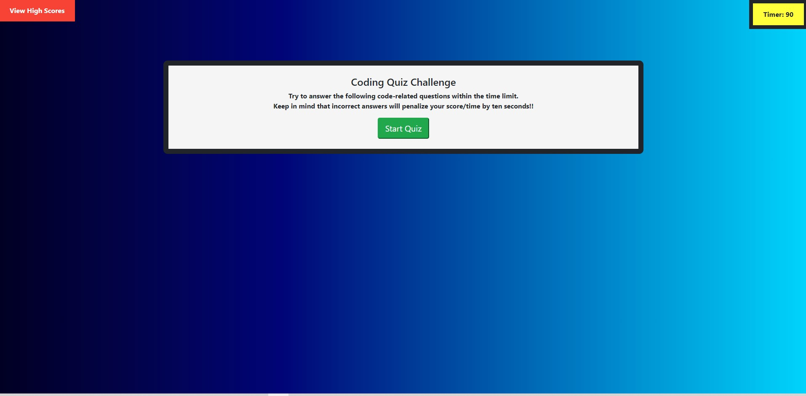
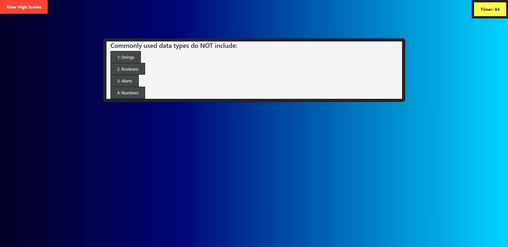

# Homework Web-APIs: Code Quiz

```
Live Site: https://ogmedina.github.io/Homework---Web-APIs/
```

## Full Stack Boot Camp Homework 4 - Code Quiz

### Description

This is the fourth assignment for the UTSA Full-Stack Bootcamp. This is a Code Quiz using JavaScript. The following items were the highlights of this assignment:

* Timed Coding Quiz

* Multiple-Choice Questions

* Run in broswer

* Dynamically updated HTML and CSS powered by JavaScript Code

* Clean, polished, and responsive user interface

### Technologies Used:
#### Front-End:
* HTML
* CSS
* JavaScript

### Screenshots

Here is a screenshot of the Code Quiz. 



